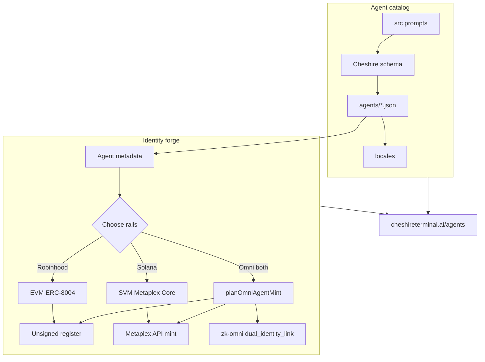

<p align="center">
  
</p>

# Cheshire Terminal Agents

<p align="center">
  <strong>Catalog + forge. One package for agent prompts and on-chain identity.</strong><br/>
  Ship Cheshire-schema agents, then register them on Robinhood Chain (EVM / ERC-8004),
  Solana (SVM / Metaplex Core), or <em>both rails</em> with optional LayerZero zk-omni link
  through the Cheshire Terminal hub.
</p>

<p align="center">
  <a href="https://cheshireterminal.ai/agents"></a>
  <a href="https://cheshireterminal.ai/agents/forge"></a>
  <a href="https://www.npmjs.com/package/cheshire-terminal-agents"></a>
  <a href="https://www.npmjs.com/package/clawdbot-go"></a>
  <a href="./LICENSE"></a>
</p>

<p align="center">
  
  
  
  
  
</p>

**Cheshire Terminal Agents** (`cheshire-terminal-agents` on npm) is the unified open-source package for:

1. **Agent catalog** — Cheshire-schema JSON agents (DeFi specialists + character personas), locales, and schema validation  
2. **Identity forge** — dual-chain registration (Robinhood Chain EVM + Solana SVM) with fail-closed safety  

Hosted surfaces: [agent hub](https://cheshireterminal.ai/agents) · [agent forge](https://cheshireterminal.ai/agents/forge) · [catalog API](https://cheshireterminal.ai/api/clawd/browser-agents)

> [!IMPORTANT]
> **Deployment and availability checked July 19, 2026:** identity, reputation, and validation registries are deployed on Robinhood Chain testnet (`46630`) and mainnet (`4663`). The [live Cheshire registry configuration](https://cheshireterminal.ai/api/robinhood/agents/config) exposes committed addresses, enforces `committed-manifest-only`, and reports runtime-code checks. The [Solana health endpoint](https://cheshireterminal.ai/api/metaplex-agents/health) reports `mainnet-beta` and discloses treasury, mint policy, authority model, holder gate, and finality. These are live-chain surfaces, not blanket consent: re-fetch trust responses, review the exact action, and obtain explicit wallet confirmation before any submission.

## What this package provides

| Surface | Included | Deliberate boundary |
|---|---|---|
| **Agent catalog** | 53 Cheshire-schema agents under `agents/`, 17-language locales, `schema/Cheshire_agent_schema.json`, import + validate scripts | Prompts + metadata only — not a trading bot runtime |
| **JavaScript SDK** | Metadata, unsigned EVM calldata, canonical deployment pins, runtime-code checks, Solana signing envelopes, hosted calls, catalog loaders | No private-key custody, automatic wallet signing, or bundled TypeScript declarations |
| **CLI** | Catalog list/show/validate; read-only forge discovery; local/hosted EVM prepare; explicit Solana mint | No silent EVM broadcast; no hidden live-write default |
| **Robinhood Chain** | Identity / Reputation / Validation contracts + `4663` / `46630` manifests | Identity is ERC-721; no fungible launcher |
| **Solana** | Metaplex API mint (Core + Agent Identity) preferred; treasury-sponsored fallback; live feed | Wallet-signed Genesis/DBC agent-token launch available (distinct from identity) |
| **Agent skill (forge)** | Portable forge `SKILL.md` + references under `skills/robinhood-agent-forge/` | Instruction content — pin like code |
| **RH crypto-agent pack** | 16 open skills vendored from go-bot (`skills/rh-crypto-agent/`: launch, swap, LP, DCA, copy-trade, viem, …) | Skills only — not the Go clawdbot binary or runtime |
| **Zero Clawd bridge** | CLI `clawdbot-info` / `clawdbot-install` → published [`clawdbot-go`](https://www.npmjs.com/package/clawdbot-go); catalog external entry; hosted [zeroclawd](https://cheshireterminal.ai/zeroclawd) | **Not** a hard dependency — optional `npx` invoke only |
| **ZK Omnichain** | msgType-4 RH↔Solana messenger, Solana receiver, Ed25519 PoK, relayer CLI, `src/zkOmni/` SDK | Live LZ send needs RPC + keys; default oneshot may simulate |
| **First-class packages** | `packages/clawd-agent-tui`, `packages/headless-agent`, `packages/layerzero-omnichain`, `packages/solana-agent-trust` — mirrored at monorepo `packages/*` | Source only (no `node_modules` / `target`); chain toolchains optional |
| **Quality gates** | Node tests (SDK, release, catalog, skill pack, packages catalog, **zk-omni**), Foundry tests, Solana `cargo test`, pack checks | Tests are not a formal security audit |



### Dual-rail omni mint (Solana + Robinhood + LayerZero)

```bash
npx cheshire-terminal-agents omni-mint-plan --file agent.json --chain 46630 \
  --solana-network solana-devnet
npx cheshire-terminal-agents omni-link-plan --solana-asset <base58> --rh-agent-id 42
```

```js
import { planOmniAgentMint, planOmniIdentityLink } from "cheshire-terminal-agents";

const plan = planOmniAgentMint({
  name: "Omni Scout",
  description: "Dual-rail agent",
  image: "ipfs://bafy…",
  ownerPubkey: "<solana>",
  chainId: 46630,
  solanaNetwork: "solana-devnet",
});
// plan.solana.metaplexMintInput → mintAndSubmitAgent / mintSolanaPrepare
// plan.robinhood.{ to, data } → wallet register()
// after both confirms → planOmniIdentityLink({ solanaAsset, rhAgentId })
```

Full guide: [docs/OMNI_MINT.md](./docs/OMNI_MINT.md) · skill `cheshire-omni-mint`.

## Install

```bash
# One-shot: installs the package + nested package runtime deps (postinstall)
npm install cheshire-terminal-agents

# Nested package CLIs (after install)
npx cheshire-headless --help
npx clawd-agent-tui --oneshot help

# Re-run nested installs / inspect
npx cheshire-terminal-agents packages-install
npx cheshire-terminal-agents packages-list
npx cheshire-terminal-agents packages-inspect

# Skip nested install (sources only): CHESHIRE_SKIP_PACKAGE_INSTALL=1 npm install cheshire-terminal-agents
```

### Zero Clawd runtime (`clawdbot-go`) — optional companion

This package is **catalog + forge + nested TS packages**. The local agent runtime
and full RH skill oneshot ship separately as
**[`clawdbot-go` on npm](https://www.npmjs.com/package/clawdbot-go)** (not a hard
dependency — install only when you want the Zero Clawd console).

Source tree: Zero Clawd / go-bot (`ClawdBrowser/go-bot`, repo
[Zero-Bruh](https://github.com/Solizardking/Zero-Bruh)) · hosted connect:
[cheshireterminal.ai/zeroclawd](https://cheshireterminal.ai/zeroclawd).

#### What shipped (bridge in this package, v1.48+)

| Piece | Role |
|-------|------|
| `src/clawdbotBridge.js` | External catalog entry, install hints, `planClawdbotInstall` / `runClawdbotInstall` |
| CLI `clawdbot-info` | Prints npm page, install commands, hosted `/zeroclawd` connect hints |
| CLI `clawdbot-install` | Optional invoke of `npx clawdbot-go …` (oneshot / skills / global / local) |
| `packages-list` / `packages-inspect` | `external: ["clawdbot-go"]` + full external catalog + oneshot hints |
| SDK exports | `clawdbotGoInstallHints`, `EXTERNAL_PACKAGE_CATALOG`, `planClawdbotInstall`, … via package root / `clawdbotBridge` |

**Deliberately not included:** hard `dependencies: { "clawdbot-go" }`, optional
dep auto-pull, or postinstall that runs Zero Clawd oneshot by default.

#### Install clawdbot-go

```bash
# Direct install (recommended)
npm i clawdbot-go
# Global CLI bins: clawdbot-go · zero-clawd · clawdbot-stack
npm i -g clawdbot-go
# If npm blocks install scripts (skills will not prepackage until allowed):
npm install -g --allow-scripts=clawdbot-go clawdbot-go

# Full stack oneshot / skills-only
npx clawdbot-go install
npx clawdbot-go skills-install --force
```

#### Bridge CLI (from this package)

```bash
npx cheshire-terminal-agents clawdbot-info
npx cheshire-terminal-agents clawdbot-install --dry-run
npx cheshire-terminal-agents clawdbot-install              # → npx clawdbot-go install
npx cheshire-terminal-agents clawdbot-install --skills-only
npx cheshire-terminal-agents clawdbot-install --global     # → npm i -g clawdbot-go
npx cheshire-terminal-agents clawdbot-install --local      # → npm i clawdbot-go

# Discoverability (external catalog, not vendored under packages/)
npx cheshire-terminal-agents packages-list
npx cheshire-terminal-agents packages-inspect
```

#### Connect from hosted Zero Clawd hub

```bash
export CLAWDBOT_CORS_ORIGINS=https://cheshireterminal.ai
# start agent web console (default :18800), then open:
# https://cheshireterminal.ai/zeroclawd
# aliases: /clawdbot-go · /clawdbot
```

| Package | npm | Hosted |
|---------|-----|--------|
| Agents / forge | [cheshire-terminal-agents](https://www.npmjs.com/package/cheshire-terminal-agents) | [agents](https://cheshireterminal.ai/agents) · [forge](https://cheshireterminal.ai/agents/forge) |
| Zero Clawd runtime | [clawdbot-go](https://www.npmjs.com/package/clawdbot-go) | [zeroclawd](https://cheshireterminal.ai/zeroclawd) |

```js
import {
  clawdbotGoInstallHints,
  EXTERNAL_PACKAGE_CATALOG,
  planClawdbotInstall,
} from "cheshire-terminal-agents";
// or: "cheshire-terminal-agents/clawdbotBridge"

console.log(clawdbotGoInstallHints().npmUrl);
// → https://www.npmjs.com/package/clawdbot-go
console.log(planClawdbotInstall({ mode: "oneshot", dryRun: true }));
```

### Robinhood crypto-agent skill pack (from go-bot)

Open RH / EVM skills for clawdbot and other agent hosts live under
`skills/rh-crypto-agent/` (pack id `rh-crypto-agent`, 16 skills). Re-sync from a
local go-bot checkout:

```bash
npm run skills:sync   # GO_BOT_SKILLS=/path/to/go-bot/skills optional
npm run skills:list
npm run skills:inspect
```

Point clawdbot at the pack root (not the whole monorepo):

```bash
export CLAWDBOT_SKILLS_DIR="$(pwd)/skills/rh-crypto-agent"
# or after npm install:
# export CLAWDBOT_SKILLS_DIR="$(npm root)/cheshire-terminal-agents/skills/rh-crypto-agent"
clawdbot catalog skills
# CLI helper:
npx cheshire-terminal-agents skills-dir
```

```js
import {
  listRhCryptoAgentSkillIds,
  getRhCryptoAgentSkillsDir,
  inspectRhCryptoAgentPack,
} from "cheshire-terminal-agents/skillPack";
```

```js
import {
  // Catalog
  listCatalogIdentifiers,
  loadAgentWithLocale,
  validateCatalog,
  // Forge
  prepareCanonicalEvmRegistration,
  createAgentForge,
  PACKAGE_NAME,
  HUB_URL,
} from "cheshire-terminal-agents";

console.log(PACKAGE_NAME, HUB_URL);
console.log(listCatalogIdentifiers().length); // 53

const farmer = loadAgentWithLocale("defi-yield-farmer", "en");
console.log(farmer.meta.title, farmer.author);

const intent = prepareCanonicalEvmRegistration({
  chainId: 46630,
  name: farmer.meta.title,
  description: farmer.meta.description,
  image: "ipfs://bafy-example",
  services: [{ name: "MCP", endpoint: "https://example.com/mcp" }],
});
```

CLI binaries: `cheshire-terminal-agents`, `ct-agents`, and legacy alias `robinhood-agents`.

```bash
npx cheshire-terminal-agents agents-list
npx cheshire-terminal-agents agents-show --id defi-yield-farmer
npx cheshire-terminal-agents agents-validate
npx cheshire-terminal-agents capabilities --site https://cheshireterminal.ai
npx cheshire-terminal-agents deployments --chain 4663
npx cheshire-terminal-agents prepare-local-robinhood --file examples/robinhood-agent.json
npx cheshire-terminal-agents zk-omni-plan --action attest --memo demo
npx cheshire-terminal-agents zk-omni-oneshot --action publish_attestation
```

Requires **Node.js `>=18.18`**, ESM-only.

## ZK Omnichain messaging (Robinhood ↔ Solana)

Nullifier-bound **LayerZero msgType 4** messages with **Ed25519 proof of knowledge**, a deployable **relayer**, Solana **receiver program**, and first-class **Zero Clawd** / **agent TUI** one-shots.

Full guide: **[docs/ZK_OMNI.md](./docs/ZK_OMNI.md)** · skill `zk-omni-messaging` / go-bot `cheshire-zk-omni`.

### What we built

| Layer | What shipped |
|-------|----------------|
| **Protocol** | msgType **4** (`MSG_ZK_OMNI`) — nullifier anti-replay (not nonce scopes like msgType 3) |
| **ZK** | Ed25519 PoK of secret; nullifier = `H(domain ‖ pk ‖ binding)`; secret never on-chain |
| **Robinhood (EVM)** | `CheshireZkOmniMessenger.sol` — peer allowlist, nullifier consume, proof length + binding checks |
| **Solana** | Anchor program `programs/zk_omni` id `Hfbc3tAGYE5nBUa5UncjSV6hoWd3JoVKdA49jPcreXFJ` — `receive_zk_omni` + nullifier PDA + **Ed25519Program** precompile check |
| **Codec / SDK** | `src/zkOmni/` — plan, encode/decode, verify, Solana ix builders, viem/web3 deliver |
| **Relayer** | JSONL journal, lifecycle `observed→verified→queued→relayed→delivered`, HTTP `/health` `/oneshot` |
| **CLI** | `zk-omni-plan`, `zk-omni-oneshot`, `zk-omni-nullifier`, `zk-omni-status`, binary `zk-omni-relayer` |
| **Zero Clawd** | `pkg/zkomni` + `clawdbot zero zkomni plan\|oneshot` + NL `zero ask "zk-omni…"` |
| **Agent TUI** | `packages/clawd-agent-tui` tools `zk_omni_plan` / `zk_omni_oneshot` |

```text
┌────────────────────┐     LayerZero V2      ┌──────────────────────────┐
│ Robinhood (30416)  │ ───────────────────► │ Solana (30168)           │
│ ZkOmniMessenger    │                      │ programs/zk_omni         │
│ sendZkOmni         │ ◄─────────────────── │ receive_zk_omni + NF PDA │
└─────────┬──────────┘                      └────────────┬─────────────┘
          │                                              │
          └────────── zk-omni-relayer ───────────────────┘
               observe → verifyZkProof → deliver (viem / web3.js)
```

### One-shot (no API key for plan)

```bash
# Plan a cross-chain ZK message
npx robinhood-agents zk-omni-plan --action attest --memo demo

# Plan + journaled relayer deliver (simulates when RPC/keys missing)
npx robinhood-agents zk-omni-oneshot --action publish_attestation --memo oneshot

# Long-running relayer HTTP service
npm run zk-omni:relayer -- --port 8787
curl -s http://127.0.0.1:8787/health

# Zero Clawd (from ClawdBrowser/go-bot)
clawdbot zero zkomni plan --action attest --memo demo
clawdbot zero zkomni oneshot --action publish_attestation
clawdbot zero ask "zk-omni message attest demo"
```

### SDK

```js
import {
  planZkOmniMessage,
  createRelayer,
  verifyZkProof,
  planSolanaReceive,
  buildRobinhoodSendCall,
} from "cheshire-terminal-agents/zkOmni";

const plan = planZkOmniMessage({
  direction: "robinhood-to-solana",
  action: "publish_attestation",
  memo: "one-shot",
});
// plan.message has nullifier, proofPubkey, proof (64-byte Ed25519)

const relayer = createRelayer({ allowSimulateFallback: true });
await relayer.init();
const job = await relayer.oneshot(plan);
```

### Source map

| Piece | Location |
|-------|----------|
| Messenger (RH) | `contracts/zk-omni/CheshireZkOmniMessenger.sol` |
| Mock LZ endpoint | `contracts/zk-omni/MockLzEndpoint.sol` |
| Solana receiver | `programs/zk_omni/` (+ `idl.json`) |
| Codec / proof / deliver / relayer | `src/zkOmni/{codec,proof,solana,deliver,relayer}.js` |
| Docs | [`docs/ZK_OMNI.md`](./docs/ZK_OMNI.md) |
| Skill (this package) | `skills/zk-omni-messaging/SKILL.md` |
| Skill (Zero Clawd) | go-bot `skills/cheshire-zk-omni/SKILL.md` |
| Zero Clawd Go | go-bot `pkg/zkomni` + `cmd/clawdbot/zero.go` |
| Agent TUI | monorepo `packages/clawd-agent-tui` |
| Env example | `.env.example` (`ZK_OMNI_*`) |

### Tests

```bash
npm run test:zk-omni                          # Node codec/relayer/deliver (11+)
forge test --match-contract CheshireZkOmniMessengerTest
cd programs/zk_omni && cargo test             # layout + program id
```

Live deliver needs `RH_RPC_URL` + `ZK_OMNI_MESSENGER_ROBINHOOD` + key (or `ZK_OMNI_SIMULATE=1`). Solana receive needs `SOLANA_RPC_URL` + keypair + peer bytes32; tx includes **Ed25519 precompile ix then `receive_zk_omni`**.

## Agent catalog

| Source | Count | Notes |
|---|---:|---|
| DeFi / Solana specialists | 43 | Yield, security, governance, CLAWD / $CLAWD specialists |
| Character personas | 10 | Buffett, Graham, Cheshire, Clawd, Alice, … |
| **Total catalog IDs** | **53** | Under `agents/` |
| Locale trees | 43 | Under `locales/` (characters are EN-primary) |

Every catalog agent uses:

| Field | Value |
|---|---|
| `author` | `cheshire-terminal` |
| `homepage` | `https://cheshireterminal.ai/agents` |
| `config.systemRole` | Cheshire Terminal–framed specialty prompt |
| schema | `schema/Cheshire_agent_schema.json` |

### Catalog npm scripts

```bash
npm run import:agents      # rebuild catalog from monorepo agents/defi-agents + characters
npm run agents:import      # alias
npm run agents:validate    # schema + content checks
npm run agents:list        # print identifiers
npm run validate:agents    # alias for agents:validate
```

Import prefers monorepo paths when this package lives inside `solana-clawd`:

- `agents/characters/*.json`
- `agents/defi-agents/src/*.json`
- `agents/defi-agents/locales/**`
- `agents/defi-agents/schema/Cheshire_agent_schema.json`

### Catalog API (SDK)

| Export | Purpose |
|---|---|
| `listCatalogIdentifiers()` | Sorted agent IDs |
| `loadCatalog()` / `validateCatalog()` | Load + schema-shape validate all agents |
| `loadAgentWithLocale(id, locale?)` | Base agent + locale overlay |
| `applyLocaleOverlay` / `loadLocaleOverlay` | Merge i18n partials |
| `convertCharacterToCheshireAgent` | Character JSON → Cheshire agent |
| `normalizeDefiAgent` | Defi pack normalize |
| `loadCheshireSchema` / `SCHEMA_PATH` | Schema access |

## Choose a chain (identity forge)

| | Robinhood Chain | Solana |
|---|---|---|
| **Runtime** | EVM · testnet `46630` or mainnet `4663` | SVM · hosted route reports `mainnet-beta` |
| **Identity** | Transferable ERC-721 (ERC-8004 registration-v1) | Wallet-owned Metaplex Core + Agent Identity attempt |
| **Authorization** | Review `register(agentURI)` calldata, value `0` | Sign fresh `CLAWD_AGENT_MINT_V2`; sponsor submits mint |
| **Authority** | Owner controls NFT; `agentWallet` clears on transfer | User owns Core; treasury remains update authority; asset starts frozen |
| **Result** | Receipt + `ownerOf` / `agentURI` / `getAgentWallet` | Signature + asset reads; registration may need retry |
| **Hosted status** | Committed addresses; runtime checks pass | Sponsored Core mint configured; treat every submit as live mainnet write |

Choose **exactly one chain** per run. A second run on the other chain creates a second independent identity — nothing bridges or merges them.

Identity assets are **not** fungible agent tokens. Robinhood identity is ERC-721. Solana identity is Metaplex Core + Agent Identity. Optional fungible Genesis/DBC agent-token launch is available via `/api/metaplex-agents/launch-token` after identity exists (wallet-signed; durable intents). Confirmed creations appear on [the live agents feed](https://cheshireterminal.ai/agents/live).

### CLI forge commands

| Command | Effect | Write risk |
|---|---|---|
| `capabilities` | Framework boundaries + hosted rail status | Read-only |
| `deployments [--chain]` | Committed addresses + runtime pins | Read-only |
| `prepare-local-robinhood --file` | Local unsigned `register(agentURI)` | Local only |
| `prepare-robinhood --file` | Hosted unsigned EVM intent | No broadcast |
| `mint-solana --confirm-live-mint --file` | Sponsored Core mint | **Live Solana write** |
| `inspect --platform … --id …` | Read one identity | Read-only |

```bash
export CHESHIRE_API_KEY=ct_sk_your_key

# Hosted unsigned EVM intent — re-check destination and trust data.
npx cheshire-terminal-agents prepare-robinhood \
  --file examples/robinhood-agent.json \
  --site https://cheshireterminal.ai

# Explicit live Solana write — fresh CLAWD_AGENT_MINT_V2 only.
npx cheshire-terminal-agents mint-solana \
  --confirm-live-mint \
  --file examples/solana-agent.json \
  --site https://cheshireterminal.ai
```

> [!CAUTION]
> `mint-solana --confirm-live-mint` submits immediately. The CLI verifies the Ed25519 envelope and rejects placeholders; that is not user consent. Do not store seed phrases in JSON files.

## JavaScript forge SDK

### Pure local EVM preparation

```js
import { prepareCanonicalEvmRegistration } from "cheshire-terminal-agents";

const intent = prepareCanonicalEvmRegistration({
  chainId: 46630,
  name: "Open Research Agent",
  description: "Publishes verifiable research.",
  image: "ipfs://bafy-example",
  services: [{ name: "MCP", endpoint: "https://example.com/mcp" }],
  supportedTrust: ["reputation", "validation"],
});

console.log(intent.chainId, intent.to, intent.data, intent.value);
```

Accepts only `46630` or `4663`, encodes `register(agentURI)`, sets `value` to `0x0`. Fetch `eth_getCode` and pass it to `assertCanonicalRuntimeCode()` before signing.

### Hosted client

```js
import { createAgentForge } from "cheshire-terminal-agents";

const forge = createAgentForge({
  baseUrl: "https://cheshireterminal.ai",
  apiKey: process.env.CHESHIRE_API_KEY,
});

const status = await forge.capabilities();
const evmIntent = await forge.prepareRobinhood(registration);
const solanaResult = await forge.mintSolana(signedSolanaMint); // live write
```

### Solana wallet authorization

```js
import {
  assertSponsoredMintAuthorization,
  buildSponsoredMintAuthorization,
  createAgentForge,
} from "cheshire-terminal-agents";

const authorization = buildSponsoredMintAuthorization(source);
const signatureBytes = await wallet.signMessage(
  new TextEncoder().encode(authorization.message),
);
const signed = {
  ...source,
  walletMessage: authorization.message,
  walletSignature: Buffer.from(signatureBytes).toString("base64"),
};
assertSponsoredMintAuthorization(signed);
await createAgentForge({
  baseUrl: "https://cheshireterminal.ai",
  apiKey: process.env.CHESHIRE_API_KEY,
}).mintSolana(signed);
```

## Deployed ERC-8004 addresses

| Contract | Mainnet `4663` | Testnet `46630` |
|---|---|---|
| Identity | [`0x70361a37951d66F8C44Cfb45873DF2Ba8b9Fc950`](https://robinhoodchain.blockscout.com/address/0x70361a37951d66F8C44Cfb45873DF2Ba8b9Fc950) | [`0xf1A30080F5dA64Ab0456F3ADC06DfD8FC9d2fDB3`](https://explorer.testnet.chain.robinhood.com/address/0xf1A30080F5dA64Ab0456F3ADC06DfD8FC9d2fDB3) |
| Reputation | [`0x8a4154a6c1Ee44B4B790948f9613E3FB934628Ff`](https://robinhoodchain.blockscout.com/address/0x8a4154a6c1Ee44B4B790948f9613E3FB934628Ff) | [`0x2137528bf45480693fd22704A978F564A3Bb1570`](https://explorer.testnet.chain.robinhood.com/address/0x2137528bf45480693fd22704A978F564A3Bb1570) |
| Validation | [`0x020d053040Da31195e5F9A992B8edA663DBb073b`](https://robinhoodchain.blockscout.com/address/0x020d053040Da31195e5F9A992B8edA663DBb073b) | [`0x4126217abb0d12D8515698E819C543466f42eefd`](https://explorer.testnet.chain.robinhood.com/address/0x4126217abb0d12D8515698E819C543466f42eefd) |

Manifests pin runtime bytecode. Do **not** redeploy and create a competing identity namespace. Before each registration, verify:

```bash
curl -fsS https://cheshireterminal.ai/api/robinhood/agents/config \
  | jq '{addressPolicy, runtimeTrustRequired, networks: [.networks[] | {
      chainId, contracts, trusted: .runtimeVerification.trusted
    }]}'
```

## Project layout

```text
cheshire-terminal-agents/          # package root (repo folder: robinhood-agents/)
├── assets/cheshire-terminal-agents.svg
├── agents/                        # 53 Cheshire catalog agents
├── locales/                       # i18n overlays
├── schema/Cheshire_agent_schema.json
├── contracts/                     # ERC-8004 registry suite
├── deployments/                   # 4663 + 46630 pins
├── deploy/                        # Foundry deploy + safety
├── examples/                      # robinhood + solana templates
├── skills/robinhood-agent-forge/  # portable agent skill
├── scripts/import-agents.mjs
├── src/
│   ├── index.js                   # SDK + catalog exports
│   ├── agentCatalog.js
│   ├── deployments.js
│   └── cli.js
├── test/
├── package.json                   # name: cheshire-terminal-agents
└── README.md
```

## Security model

- Never request, store, print, or transmit private keys or seed phrases.
- Hosted Robinhood API prepares unsigned calldata and never broadcasts for the user.
- Re-fetch registry config before EVM writes; require zero value; verify bytecode.
- Sponsored Solana mint still needs a fresh owner wallet message + signature.
- Catalog prompts are instruction content — not custody or auto-execution.
- Agent identity assets are not promises of investment value.

## Development & tests

```bash
npm test                 # SDK + release + catalog tests
npm run check            # syntax + full Node suite
npm run import:agents    # rebuild catalog from monorepo sources
npm run agents:validate
npm run setup:solidity
npm run test:solidity
npm run pack:check
```

| Suite | Focus |
|---|---|
| `test/sdk.test.js` | EVM calldata, deployment pins, Solana auth, hosted client |
| `test/release.test.js` | MIT, exports, deploy gates, offline CLI |
| `test/agents-catalog.test.js` | Schema, identifiers, locales, content preservation |
| `deploy/test/*` | Deployment safety + Solidity registry tests |

## Version note

| Version | Role |
|---|---|
| `1.43.0` | First catalog-only npm publish |
| **`1.44.0`** | **Unified Cheshire Terminal Agents** — catalog + dual-chain forge (this package) |

Legacy package name `@cheshire-terminal/robinhood-agents` and CLI alias `robinhood-agents` remain documented for migrations. Prefer `cheshire-terminal-agents` / `ct-agents`.

## License

[MIT](LICENSE) © Cheshire Terminal contributors.
